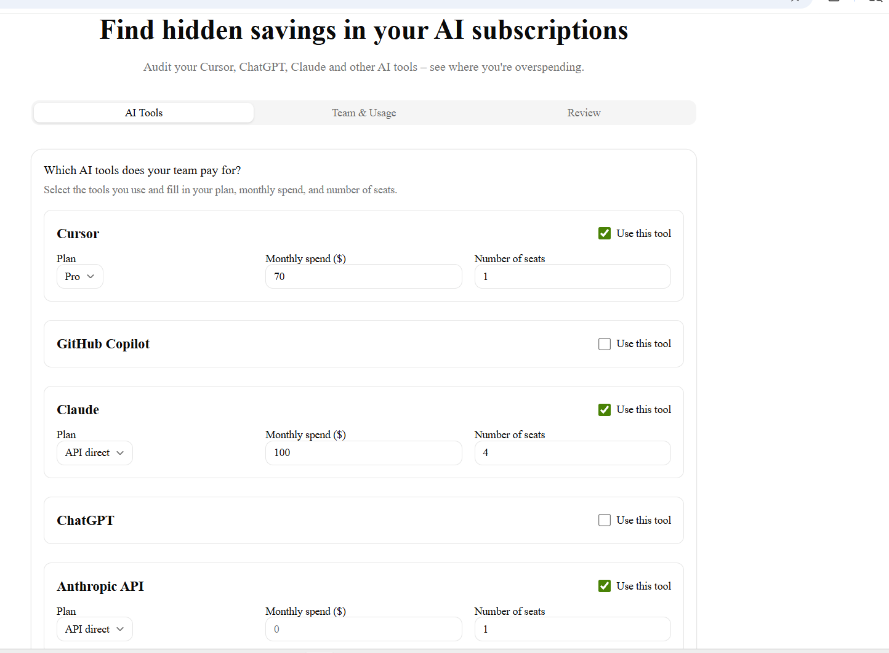

# AI Spend Audit

A free tool for startup founders and engineering managers to audit their AI tool subscriptions and find savings. Built as a Round 1 assignment for Credex.

**Live demo:** [https://credex-audit-ebon.vercel.app](https://credex-audit-ebon.vercel.app)

## 🚀 Features

- **Multi-step form**: Input your AI tools (Cursor, GitHub Copilot, Claude, ChatGPT, etc.), plan, spend, and seats.
- **Audit Engine**: Hardcoded pricing rules to calculate potential savings by downgrading plans or switching to cheaper alternatives.
- **Results Page**: Displays total monthly/yearly savings, a per-tool breakdown with recommendations, and a CTA for high-savings cases.
- **AI Summary**: Generates a personalized ~100-word summary (with a fallback template) using the Groq API.
- **Lead Capture**: Stores email and optional fields in Supabase.
- **Transactional Email**: Sends a confirmation email and a shareable link via Resend.
- **Shareable Results**: Each audit gets a unique public URL that strips PII and includes Open Graph tags for social sharing.
- **Honeypot Protection**: Basic abuse protection on the email capture form.

## 🛠️ Tech Stack

- **Framework**: Next.js 16 (App Router, TypeScript)
- **Styling**: Tailwind CSS, shadcn/ui
- **Database & Auth**: Supabase (PostgreSQL)
- **Email**: Resend
- **AI**: Groq API (Llama 3.1 8B)
- **Testing**: Vitest
- **CI/CD**: GitHub Actions + Vercel

## 📦 Getting Started

### Prerequisites

- Node.js 18+
- A Supabase account (free tier)
- A Resend account (free tier)
- A Groq API key (free tier – optional, fallback works without it)

### Installation

1. Clone the repository:

   ```bash
   git clone https://github.com/munwar5632-os/credex-audit
   cd credex-audit
   ```

2. Install dependencies:

   ```bash
   npm install
   ```

3. Set up environment variables (see below).

4. Run the development server:

   ```bash
   npm run dev
   ```

5. Open [http://localhost:3000](http://localhost:3000).

### Environment Variables

Create a `.env.local` file in the root directory. This file is ignored by Git. Use the following template:

```env
# Supabase (required)
NEXT_PUBLIC_SUPABASE_URL=https://your-project.supabase.co
NEXT_PUBLIC_SUPABASE_ANON_KEY=eyJ...

# Resend (required – transactional emails)
RESEND_API_KEY=re_...

# Groq (optional – AI summary, fallback works without it)
GROQ_API_KEY=gsk_...

# App URL (development or production)
NEXT_PUBLIC_APP_URL=http://localhost:3000
```

For production deployment on Vercel, add the same variables in your project **Settings → Environment Variables**.

> **Never commit real secrets to GitHub.** The `.env.local` file is already ignored via `.gitignore`.

## 🧪 Testing

Run the audit engine tests (6 tests covering downgrade logic, cross‑tool recommendations, totals, and API tools):

```bash
npm run test
```

All tests should pass. The CI workflow (`.github/workflows/ci.yml`) runs them on every push to `main`.

## 🚀 Deployment

This project is configured for automatic deployment on **Vercel**. Pushing to `main` triggers a build and deploy. Remember to set all environment variables in the Vercel dashboard before the first deployment.

## 🤔 Key Decisions (5 trade‑offs)

1. **Hardcoded audit rules vs AI** – Used hardcoded deterministic pricing rules because financial recommendations must be defensible and reproducible.
2. **LocalStorage persistence** – No login required; users can refresh without losing form data.
3. **Supabase vs local DB** – Free tier, easy setup, and built‑in UUID generation for shareable links.
4. **Next.js App Router** – Simplified API routes (no separate backend) and server components for shareable pages.
5. **shadcn/ui** – Rapid UI development without building components from scratch, while keeping full customisation.

## 📷 Screenshots

> Add your screenshots to `public/screenshots/` and update the links below.

  
_Multi‑step form with tool selection_

  
_Savings summary, AI summary box, email capture_

  
_Public page without PII_

## 📄 License & Attribution

This project was built as part of the Credex Web Development Intern assignment (Round 1). All code is owned by the author and shared publicly for portfolio use.

## 🙏 Acknowledgements

- [Credex](https://credex.rocks) for the assignment and the opportunity.
- [shadcn/ui](https://ui.shadcn.com) for the component library.
- [Supabase](https://supabase.com), [Resend](https://resend.com), [Groq](https://groq.com) for free tiers that made this possible.

**Questions or feedback?** Feel free to open an issue on GitHub.
